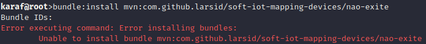

# soft-iot-dlt-architecture

## 1 - Pré-requisitos

- Java Developer Kit (JDK) 1.8
- Maven 3.0.4 ou superior
- ServiceMix

## 2 - Instalação do ServiceMix

- Baixe o servicemix no [site oficial](http://servicemix.apache.org/downloads/servicemix-7.0.0.html).

- [Manual de instalação](http://servicemix.apache.org/docs/7.x/quickstart/installation.html)

## 3 - Configurações iniciais

Com o servicemix instalado podemos inicar as configurações básicas necessárias para acompanhar os passos de instalação de cada _bundle_ da arquitetura soft-iot-dlt.

### 3.1 - Adicionar ServiceMix como variável de ambiente

Após baixar e descompactar o Apache ServiceMix é recomendado que ele seja configurado como variável de ambiente. Afim de facilitar o acesso do mesmo em qualquer diretório através do comando `servicemix`.

#### 3.1.1 - Linux

Para fazer isso linux será necessário executar o seguinte comando.

```
echo "export PATH=$PATH:SERVICEMIX_HOME/bin" >> ~/.bashrc
```

Atenção: SERVICEMIX_HOME deve ser substituido pelo caminho do diretório onde você descompatou o Apache ServiceMix.

Exemplo:

Caso tenha descompactado o servicemix na pasta `/opt/servicemix`
então o comando comando ficará:

```
echo "export PATH=$PATH:/opt/servicemix/bin" >> ~/.bashrc
```

Reinicie terminal e em seguida execute o comando `servicemix` para executar o terminal do servicemix.

#### 3.1.2 - Windows

...

### 3.2 - Repositório fonte

Esse passo é importante pois é graças a ele que será possivel utilizar os comandos de instalação dos bundles
pertencentes a arquitetura `soft-iot-dlt`.

```
config:edit org.ops4j.pax.url.mvn
config:property-append org.ops4j.pax.url.mvn.repositories ", https://jitpack.io@jitpack.io"
config:update
```

### 3.3 - Gerencia de bundles OSGI

Tutorial de [como fazer um _bundle_ OSGI com o framework blueprint](https://github.com/larsid/osgi-blueprint-bundle-archetypes#readme).

<!-- TODO:
  Explicar o que é um bundle OSGI
  Como criar um bundle OSGI utilizando blueprint.
-->

#### 3.3.1 - Terminal

É possível gerenciar os bundles OSGI utilizando o terminal para fazer isso utilize os comandos com préfixo `bundle`, caso tenha dúvidas utilize o comando `bundle --help` para visualizar a lista de comandos disponíveis. Segue abaixo uma tabela com os comandos mais utilizados.

| Comando         | Ação                                                                      | Exemplo                                         |
| --------------- | ------------------------------------------------------------------------- | ----------------------------------------------- |
| bundle:list     | Lista todos os bundles instalados.                                        | bundle:list                                     |
| bundle:install  | Instala um novo bundle.                                                   | bundle:install mvn:group-id/artifact-id/version |
| bundle:unistall | Desistala um bundle.                                                      | bundle:unistall `<ID>`                          |
| bundle:start    | Inicia a execução de um bundle.                                           | bundle:start `<ID>`                             |
| bundle:stop     | Para a execução de um bundle.                                             | bundle:stop `<ID>`                              |
| bundle:restart  | Reinicia um bundle.                                                       | bundle:restart `<ID>`                           |
| bundle:diag     | Exibe informações que justificam o por que o bundle não está inicalizando | bundle:diag                                     |

> Dica: Utilize o webconsole para instalar ou atualizar um bundle recém construido.

#### 3.3.2 - WebConsole

O `webconsole` é uma interface gráfica web que permite gerenciar os bundles de forma simples. Com ele é possível instalar, remover, iniciar, parar e atualizar _bundles_.

O processo de instalação do webconsole é simples, bastando apenas Executar o comando abaixo no terminal do ServiceMix.

```
feature:install webconsole
```

Para visualizar o webconsole do karaf é necessário acessar a URL abaixo.

```
http://localhost:8181/system/console/bundles
```

> :warning: O usuário e senha é "karaf" :warning:

## 4 - Visão geral

<!-- Por que da arquitetura soft-iot-dlt -->

A `soft-iot-dlt` é uma arquitetura inspirada e totalmente compatível com a [soft-iot](http://www.wiser.ufba.br/prazeres/pdfs/soft-iot.pdf) ([código fonte](https://github.com/WiserUFBA)). Ela surge a partir da ideia de balancear a carga dos _gateways_
utilizando um algoritimo de balanceamendo distribuido e seguro.

A `soft-iot-dlt` é composta por 5 _bundles_ especificos da arquitetura e uma [implementação](https://github.com/larsid/soft-iot-mapping-devices) baseada no [soft-iot-mapping-devices](https://github.com/WiserUFBA/soft-iot-mapping-devices) utilizado na plataforma `soft-iot` como demonstrada na imagem abaixo.

<figure>
  
  <figcaption>Imagem 1 - Fluxo dos dados na arquitetura `soft-iot-dlt`.</figcaption>
</figure>

## 5 - Instalação da soft-iot-dlt

Após ter executado o [passo 3.2](#32---repositório-fonte) será possível utilizar o comando abaixo para instalar qualquer bundle da arquitetura.

    bundle:install mvn:com.github.larsid/<NOME_BUNDLE>/<VERSION>

Exemplo:

Caso queira instalar a versão `master` do `soft-iot-dlt-client-tangle` então o comando a ser executado deverá ser:

    bundle:intall mvn:com.github.larsid/soft-iot-dlt-client-tangle/master

:warning: Caso tente instalar apartir de um _group-id_, _arctifact-id_ e/ou versão que não existe o erro abaixo será exibido. :warning:



Alguns _bundles_ possuem dependências de serviços e isso significa que o _bundle_ não será inicializado o serviço que ele precisa não estiver disponivel. Por esse motivo é recomendado os que instale os _bundles_ da `soft-iot-dlt` na ordem demonstrada pelo ID da tabela de dependências abaixo.

| ID  | Bundle                                                                             | Dependência ID |
| :-: | ---------------------------------------------------------------------------------- | :------------: |
|  0  | [soft-iot-mapping-devices](https://github.com/larsid/soft-iot-mapping-devices)     |       -        |
|  1  | [soft-iot-dlt-id-manager](https://github.com/larsid/soft-iot-dlt-id-manager)       |       -        |
|  2  | [soft-iot-dlt-client-tangle](https://github.com/larsid/soft-iot-dlt-client-tangle) |       -        |
|  3  | [soft-iot-dlt-auth](https://github.com/larsid/soft-iot-dlt-auth)                   |       0        |
|  4  | [soft-iot-dlt-load-balancer](https://github.com/larsid/soft-iot-dlt-load-balancer) |   0, 1, e 2    |
|  5  | [soft-iot-dlt-load-monitor](https://github.com/larsid/soft-iot-dlt-load-monitor)   |   0, 1, e 2    |

_Tabela de dependências entre bundles_

## 5.x - Docker

<!-- Todo:
    Colocar a imagem docker no docker hub.
    Disponibilizar o link aqui.
    Fazer tutorial ensinando como rodar uma instância.
    Fazer tutorial ensinando como rodar várias instânias.
 -->

## 6 - Próximo passo

Caso tenha se interessado pela arquitetura soft-iot-dlt e queria saber mais detalhes sobre a implementação [clique aqui](https://github.com/larsid/soft-iot-dlt-auth) e conheça o `soft-iot-dlt-auth` ponto de entrada de toda à arquitetura.
